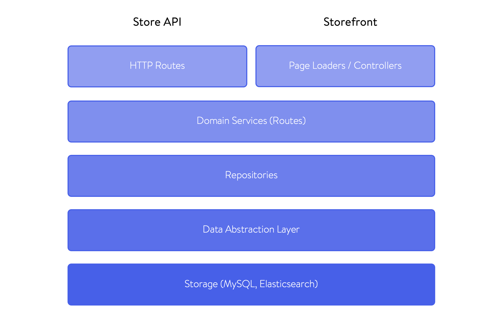

# Store API

Every interaction between the store and a customer can be modeled using the Store API. It serves as a normalized layer or an interface to communicate between customer-facing applications and the Shopware Core. It can be used to build custom frontends like SPAs, native apps, or simple catalog apps. It doesn't matter what you want to build as long as you are able to consume a JSON API via HTTP.

Whenever additional logic is added to Shopware, the method of the corresponding service is exposed via a dedicated HTTP route. At the same time, it can be programmatically used to provide data to a controller or other services in the stack. This way, you can ensure that there is always common logic between the API and the Storefront and almost no redundancy. It also allows us to build core functionalities into our Storefront without compromising support for our API consumers.

## Extensibility

Using plugins, you can add custom routes to the Store API \(as well as any other routes\) and also register custom services. We don't force developers to provide API coverage for their functionalities. However, if you want to support headless applications, ensure that your plugin provides its functionalities through dedicated routes.

<PageRef page="../../guides/plugins/plugins/framework/store-api" />

## What next?

* To start working with the Store API, check out our [Quick Start guide](https://shopware.stoplight.io/docs/store-api/docs/guides/quick-start/README.md)  and explore all endpoints in our reference guide.

* An interesting project based \(almost\) solely on the Store API is [Shopware PWA](../../products/pwa.md).
