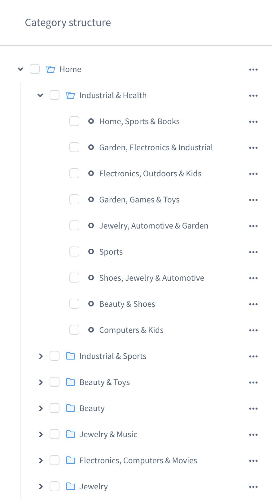

# Categories

Products in Shopware are organized in categories. Categories are represented as a hierarchical tree and they contain products. A product can be contained in multiple categories. Catalog categories provide structure to your catalog content.

There is a single category tree that represents the whole product catalog of your store.

## Product assignments

There are two ways that products can be assigned to a category. Either through an explicit assignment or using a Dynamic Product Group. Explicit assignments are stored in a database table, whereas dynamic groups are a collection of filters that get evaluated at execution time.

## Navigation

Categories also serve as entry points for your store navigation. For every [Sales Channel](sales-channels.md), you can select a category to be the root of your navigation. Shopware will then build the navigation based on that category's child categories. Parent categories also contain the explicit assignments of their children based on the Inheritance relation between categories.


Categories can be globally hidden from store navigations based on a hide in navigation flag.


## CMS layouts

Every category has a [CMS layout](../core/shopping-experiences-cms.md) assigned to it. The layout dictates in which way the category will be displayed. It is very useful to centralize the management of CMS pages and hydrate it based on the category configuration.

## Types

In addition to being a product collection and a navigation item, categories can also be used as a *structuring element* \(which in itself is not a category that can be visited, but it is visible in the tree\) or a *custom link* redirecting to an external resource.
