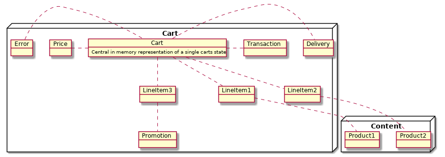
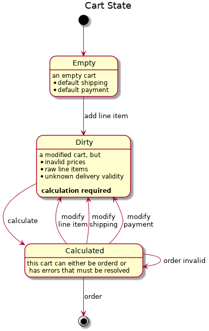
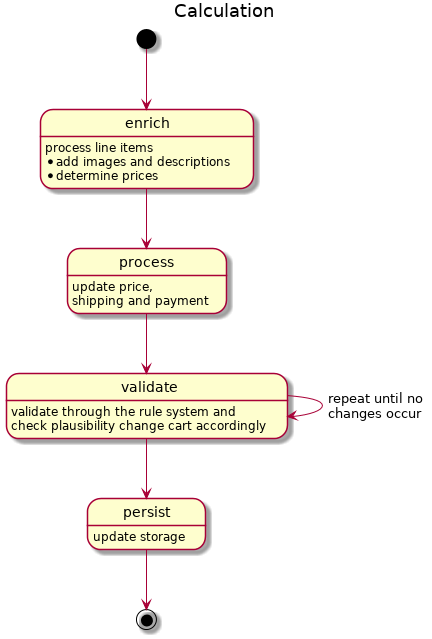
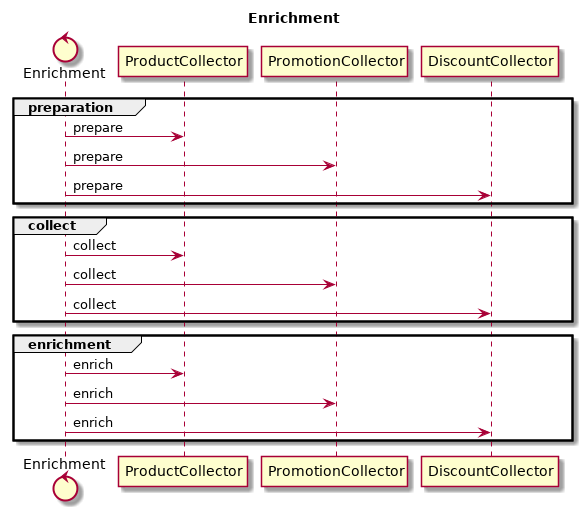
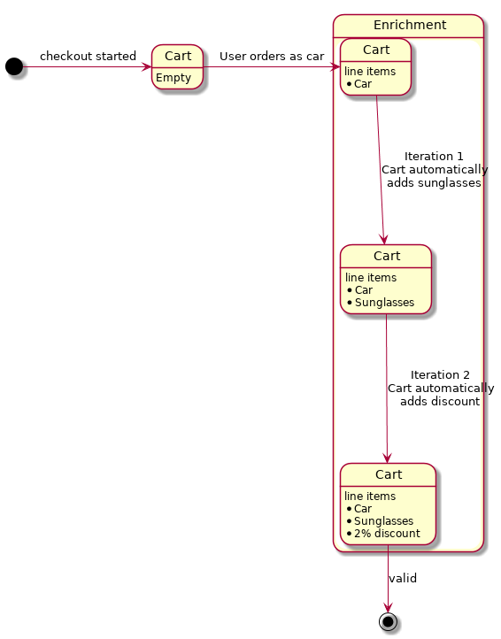

# Cart

Shopping cart management is a central feature of Shopware 6. The shopping cart resides in the checkout bundle and is a central part of the checkout process.

## Design goals

The cart was designed with a few design goals in mind.

### Adaptability

Although many services exist to make working with the cart simple and intuitive, the cart itself can be changed through various processes and adapt to numerous use cases.

### Performance

With the No Waste philosophy, the cart is designed by identifying key processes and optimizing upon them. Therefore the amount of calculations, queries and iterations is kept to a minimum and a clear state management is implemented.

### Abstraction

The cart has very few hard dependencies on other core entities in Shopware 6. Entities such as products, surcharges, or discounts are referenced through interfaces which the line items in the cart reference.

## Cart Struct

`\Shopware\Core\Checkout\Cart\Cart`

An instance of this class represents one single Cart. As you can see in the diagram below, relations to central Entities of the System are omitted. This allows Shopware 6 to manage multiple carts per user and per SalesChannel, or one across all sales channels. The only identification is a token hash.



This is a highly mutable data structure that is acted upon from requests and calculated and validated through services. It contains:

### Line Items

A line item represents an order position.

* It may be a _shippable_ good, a download article, or even a bundle of many products.
* Line items contain properties that tell the cart how to handle changes in line items. E.g. _stackable_ - quantity can be changed, _removable_ - removable through the api, and so on.
* A line item is the main extension point for the cart process. Therefore a promotion, a discount, or a surcharge is also a line item.
* A line item can even contain other line items. So a single order position can be the composition of multiple single line items.

### Transaction

A payment in the cart. Contains a payment handler and the amount.

### Delivery

A shipment in the cart. Contains a date, a method, a target location and the line items that should be shipped together.

### Error

Validation errors that prevent ordering that cart.

### Tax

The calculated tax rate for the cart.

### Price

The price of all line items including tax, delivery costs, and vouchers discounts and surcharges.

## State

Shopware 6 manages the cart's state through different services. The diagram below illustrates the different states the cart can have and state changes it can go through.



## Calculation

Calculating a cart is one of the more costly operations an ecommerce System must support. Therefore the cut of the interfaces and the design of the process follows the no waste philosophy of Shopware 6 very closely. Calculation is a multi-stage process that revolves around the mutation of the data structure of the cart struct shown in the diagram below.



### Cart Enrichment

Enrichment secures the _Independence_ and _Adaptability_ of Shopware 6. As shown in the below code snippet, the Cart is able to create and contain line items that are initially empty and will only be loaded \(=**enriched**\) during the calculation.

```php
<?php 

use Shopware\Core\Checkout\Cart\Cart;
use Shopware\Core\Checkout\Cart\LineItem\LineItem;

$lineItem = new LineItem(/* ... */);
/** @var $cart Cart */
$cart->getLineItems()->add($lineItem);

$lineItem->getPrice(); // is now null
// enrich the cart
$lineItem->getPrice(); // now set up
```

This process is transparently controlled from the cart but executed through implementations of the `\Shopware\Core\Checkout\Cart\CartDataCollectorInterface`. This interface is cut in order to reduce the number of database calls necessary to set up the cart's data structure for **price calculation** and **inspection** \(meaning: rendering in a storefront, reading from the API\).

A default set of collectors is implemented in Shopware 6 which has a set call order shown in the diagram below.

| Service ID | Task |
| :--- | :--- |
| Shopware\Core\Content\Product\Cart\ProductCartProcessor | Enrich all referenced products |
| Shopware\Core\Checkout\Promotion\Cart\CartPromotionsCollector | Enrich add, remove and validate promotions |
| Shopware\Core\Checkout\Shipping\Cart\ShippingMethodPriceCollector | Handle shipping prices |



## Cart Processors - Price Calculation And Validation

After a cart is enriched, the cart is processed. The price information for all individual `LineItems` is now set up, for the sums to be calculated. This happens in the `\Shopware\Core\Checkout\Cart\Processor` class, following these steps:

* The `lineItem` prices are calculated by applying the quantity and the tax rate
* Deliveries are set up and cost calculated.
* Different Cart values are summed up \(incl, excl. vat, inc. excl. shipping\)

Afterwards the calculation of prices is done and the cart can be inspected from the rule system.

## Context rules

After the cart has been processed, it is validated against the rules which can lead to a change in the carts' data, so a revalidation becomes necessary. We can envision a scenario where we sell cars and have the following rules:

* Everybody buying a **car** gets a **pair of sunglasses** for free
* Every Cart containing **two products** gets a discount of **2%**



As you can see in the diagram above, the cart is modified during the enrichment process on a first pass to add the sunglasses, and then on a second pass to contain the discount triggered by having 2 products. Which results in the expected state of one car, one pair of sunglasses, and a two-percent discount.

## Cart storage

Contrary to other entities in the System the Cart is not managed through the Data Abstraction Layer. The Cart can only be written and retrieved as a whole. This is done for one reason mainly: The cart only makes sense as a whole. As discussed in the sections the workload of Shopware 6 can only be performed on the whole object in memory.

## Cart Control

The state changes and cart mutation is handled automatically by a facade the `\Shopware\Core\Checkout\Cart\SalesChannel\CartService`. It controls, sets up, and modifies the cart struct.
