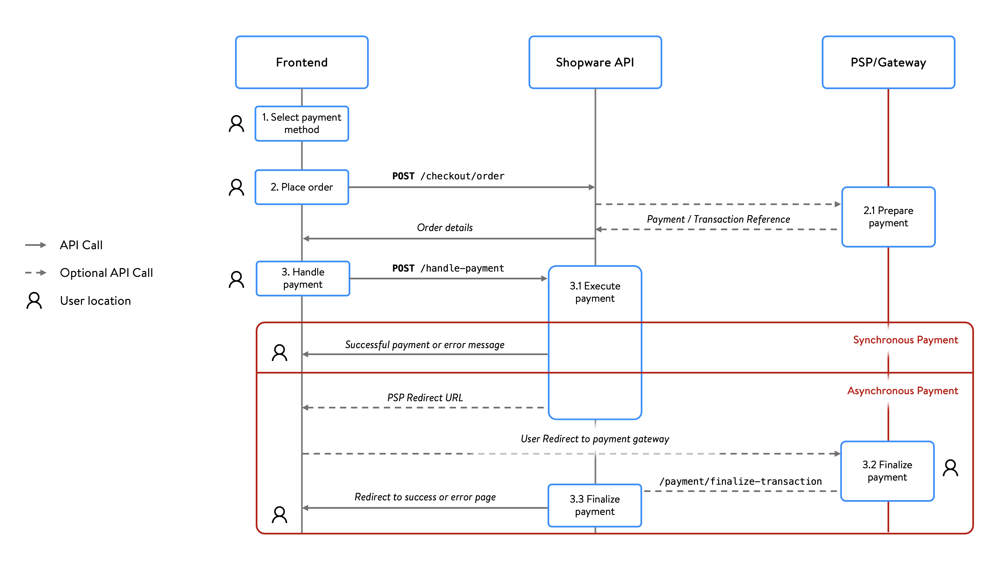

# Payments

Shopware 6's payment system is an integral part of the checkout process. A payment is applied to a transaction of an order. As with any order change this is done through the state machine. At its core the payment system is composed from payment handlers, these extend Shopware to support multiple different payment types. A list of all payment handlers is stored in the database.


This page contains two parts - the first one describes the flow of payments whereas the second one deals with the specific implementation of the different parts involved.

If you want to skip to the implementation details go straight to [Payment Handler Implementation](#payment-handler-implementation).


## Payment Flow

The payment and checkout flow consists of two essential steps. Placing the order and handling the payment. These steps are outlined in the diagram below:

The diagram above shows the payment flow for headless environments, however for the single-stack scenario (i.e. when our default storefront is used) the differences are minor and described in the section below.

If you want to see a specific example of a headless payment using the Store API, head to our [API documentation](https://shopware.stoplight.io/docs/store-api/docs/guides/quick-start/handling-the-payment.md).

### 1. Select Payment Method

Let's start easy. The first step for a user is to select their desired payment. The current payment method is stored in the user context, which can be manipulated by calling the corresponding route or endpoint (`/store-api/context`).

### 2. Place Order

In this step, an order is created. It takes no required parameters, but creates the order basend on the users current context and cart. You can add additional information like tracking parameters or comments. Shopware creates the order internally together with an open transaction which acts as a placeholder for the payment.

A transaction contains information like a unique ID, the payment method or the total amount to be payed. An order can have multiple transaction, but in this step only a single one is created.

#### 2.1 Prepare Payment (optional)

Some payment integrations already create a payment reservation or authorization at this point. This totally depends on the specific payment extension and is not standardized by Shopware in any way. However, usually some type of payment intent or transaction reference is stored in the meantime.

### 3. Handle Payment

This step can only be executed **after** an order has been placed. It starts the payment by determining the correct payment handler for the selected payment method.

#### 3.1 Payment Handler

There are two types of payment handlers in Shopware

 * Synchronous
 * Asynchronous

**Synchronous Payment**

In this scenario, the payment integration usually makes a request to the payment gateway to execute or authorize the payment. The gateway immediately responds with a status and Shopware can give feedback to the user.

**Asynchronous Payment**

These payments include a user redirect. The redirect target is defined by the payment integration and contains information about the transaction as well as a **callback URL** for the payment gateway.

The frontend can also define success and error URLs that will be used for the eventual redirect after step 3.3.

In the default storefront, this redirect takes place automatically. In the headless scenario, Shopware returns the redirect URL within the  API response, so the frontend can perform the redirect.

#### 3.2 Payment Execution on Gateway (optional)

This step is only executed for asynchronous payments. After being redirected, the user can perform final checks or authorizations on the payment gateway UI. After that, the payment gateway redirects the user to the callback URL provided in step 3.1 along with a parameter indicating the outcome of the payment.

#### 3.3 Payment Finalize (optional)

This step is only executed for asynchronous payments. It is triggered by the callback URL (which points to `/payment/finalize-transaction`) that has been provided to the payment gateway in step 3.1. Depending on the payments success, Shopware updates the transaction status and redirects the user to the corresponding finish page from step 3.


**Disclaimer**

The actual implementation of payment integrations differ between providers. For that reason our specification does not include any guidelines about payment states or specific API calls to be made. Some integrations share data between the steps or provide and call upon web hooks after the payment process has been finished. These implementations go beyond our standards.


## Payment Handler Implementation

Payment handlers get executed after an order was placed. Per default this happens during the checkout.

As illustrated in the diagram above, the payment handler is invoked to redirect to the foreign system handling the payment. This foreign system then notifies the platform and the successful payment is stored. This is achieved by a handler implementing `\Shopware\Core\Checkout\Payment\Cart\PaymentHandler\AsynchronousPaymentHandlerInterface`

This interface is composed out of two methods:

### `pay`

Will be called after an order has been placed. You receive a `Shopware\Core\Checkout\Payment\Cart\PaymentTransactionStruct` which contains the transactionId, order details, the amount of the transaction, return URL, payment method information and language information. Please be aware, Shopware supports transactions and you must use the amount provided and not the total order amount. The pay method can return a RedirectResponse to redirect the customer to an external payment gateway. Note: The PaymentTransactionStruct contains a return URL. Pass this URL to the external payment gateway to ensure that the user will be redirected to this URL.

### `finalize`

Will only be called if you returned a RedirectResponse in your pay method and the customer has been redirected from the payment gateway back to Shopware. You might check here if the payment was successful or not and update the order transaction state accordingly.

## Transaction Handler

The order module provides a useful interface to simplify state changes on a transaction.

`\Shopware\Core\Checkout\Order\Aggregate\OrderTransaction\OrderTransactionStateHandler` contains the state change methods as a pragmatical interface.
