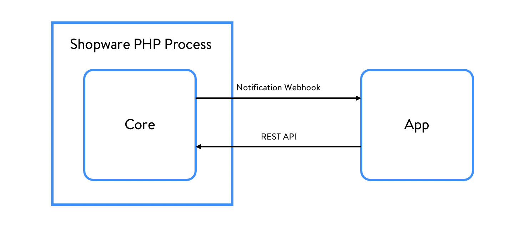
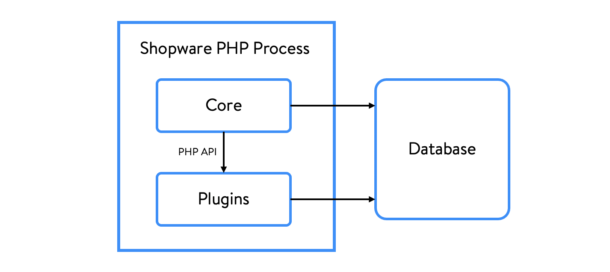

# Extensions

In order to provide users \(i.e., developers\) with a clear abstraction, Shopware consists of a Core designed in a way that allows for a lot of extensibility without sacrificing maintainability or structural integrity. Some of those concepts were already introduced in the [Frameworks](../framework/) section.

## Apps

Starting with Shopware 6.4.0.0, we introduced a new way to extend Shopware using the newly created app system. Apps are not executed within the process of the Shopware Core but are notified about events via webhooks, which they can register. They can modify and interact with Shopware resources through the [Admin REST API](https://shopware.stoplight.io/docs/admin-api).

## Plugins

Plugins are executed within the Shopware Core process and can react to events, execute custom code or extend services. They have direct access to the database and guidelines are in place to ensure update-compatibility, such as a service facade or database migrations.


**Plugins and Shopware cloud** - Due to their direct access to the Shopware process and the database, plugins are not supported by Shopware cloud.


## Start Coding

Refer to Guides section to get an [overview of both extension systems and how they differ](../../guides/plugins/overview.md).
