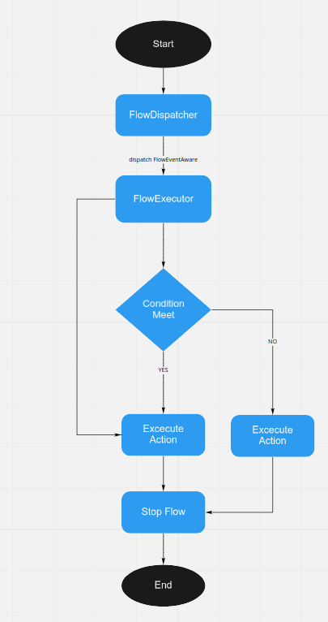

# Flow Builder

Flow Builder is a Shopware automation solution for shop owners with great adaptability and flexibility. With Flow Builder, you can build workflows to automate tasks tailored to your business needs without programming knowledge.

## Flow

A flow is an automation process in your business. From here, you can specify which actions are triggered by a trigger. Additionally, you can define conditions for these actions under which the actions are to be executed. If multiple flows with the same trigger, the priority point will decide which flow will perform first.

## Trigger

A trigger is an event that starts the flow and detects the event from the Storefront or the application. A trigger could have multiple actions.

## Condition

This is a business rule to determine whether the action should be executed.

## Action

The tasks that execute when the trigger happens or the certain conditions are met. There is a special action called "Stop flow", which will stop any further action below.

## Flow Templates
		
Pre-created [flows](#flow) built are designated as flow templates.

The flow library contains the flow template listing that is shipped with Shopware. Two main ways to create a flow template in the template library are by [apps](../../guides/plugins/plugins/framework/flow/README.md) and [plugins](../../guides/plugins/apps/flow-builder/README.md).

We can help merchants reduce the complexity of creating an automation process in their business by using a flow template rather than building a flow. As a merchant, you may design a flow more easily by using the flow templates. So you don't have to create complicated flows on your own.

You can view the details of a flow template just like a regular flow. However, flow templates can't be modified.

## How a flow sequence is evaluated

In Shopware, you have multiple interfaces and classes for different types of events. For Flow Builder, those triggers mentioned above are implements from the *Aware* interface.

Once the action on the Storefront or from the app happens, the FlowDispatcher will dispatch FlowEventAware to the FlowExecutor. From here, the FlowExecutor will check the condition to decide whether to execute the action.

Here is an example flow of what happens in the system when an order is placed on the Storefront.

