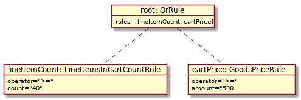
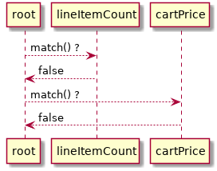

# Rules

The rule system pervades Shopware 6. It solves the problem of calculating the cart differently based on the context \([`SalesChannel`](../commerce/catalog/sales-channels.md), `CustomerGroup`, etc\) and the current state \([`LineItems`](../commerce/checkout-concept/cart.md#line-items), `Amount`, etc\), but user controlled and decoupled from the [cart](../commerce/checkout-concept/cart.md) itself. In theory, [every part of Shopware 6](../../resources/references/core-reference/rules-reference.md) can contribute to the set of available rules.

## Scenario

The problem solved by the rule system can be imagined by the following scenario:

**"If a customer orders a car, a pair of sunglasses will be free in the same order."**

This relies on multiple different data points:

* A product called car
* A product called sunglasses

Both are independent, separately buyable, and stored in the database.

* The whole state of a single cart
* The quantity of a line item

This is a runtime concept in memory, resulting in the adjustment of a single line item's price, which in turn changes the whole calculation of the cart.

In this example, the rule system sits right in the middle of the scenario, providing the necessary mapping information to get from point a \(`car` is in the cart\) to point b \(`sunglasses` are free\).

## Rule Design

The center of the rule system is the `Rule`. It is realized as a variant of the [Specification pattern](https://en.wikipedia.org/wiki/Specification_pattern) but omits the name due to a few key differences.

* Storable, retrievable and identifiable through the [Data Abstraction Layer](../../guides/plugins/plugins/framework/data-handling/).
* A `RuleScope` parameter instead of any arbitrary object
* `match` instead of `isSatisfiedBy`

As well as a Specification class, a Rule class represents a condition to fulfill. It implements the `match(RuleScope $scope)` function to validate user defined values against a runtime state. See the following object diagram for a better understanding:

This will result in the following call order:

As you can see, a single rule can either contain user defined values or other user defined rules. These are Container rules. The rule system here bears some resemblance to the [SearchCriteria](../../guides/plugins/plugins/framework/data-handling/reading-data.md#Filtering), although independent. A Search Criteria is the representation of a query that gets translated and executed through the storage engine. The rule matches in-memory in PHP and does not access the underlying storage.

The last building block is the **Rule Scope**. The Scope contains the current runtime state of the application and is necessary to match the data. The whole picture is visualized in the next diagram:

## Connection to the System

Following Shopware 6s data-driven approach, the rule objects are stored in the database and used to trigger behavior in the cart through the associations present.

For more insights on the rule validation, take a look at the [Cart documentation](../commerce/checkout-concept/cart.md)
