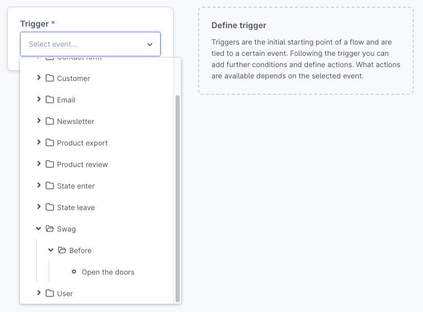

# Add custom flow trigger


The Shopware app custom flow triggers are only accessible from 6.5.2.0 and later versions.


In addition to the default triggers, you have the option to incorporate custom, pre-defined, and adjustable triggers into the flow builder.



After reading, you will be able to :

* Create the basic setup of an app.
* Create custom triggers for the flow builder.
* Use an API to interact with custom triggers.

## Prerequisites

Please ensure you have a working Shopware 6 store (either cloud or self-hosted). Prior knowledge about the Flow Builder feature of Shopware 6 is useful.

Please see the [Flow Builder Concept](../../../../concepts/framework/flow-concept.md) for more information.

## Create the app wrapper

To get started with your app, create an `apps` folder inside the `custom` folder of your Shopware dev installation. Next, create another directory inside for your application and provide a `manifest.xml` file following the structure below:

```text
└── custom
    ├── apps
    │   └── FlowBuilderTriggerApp
    │       └── Resources
    │           └── app
    │               └── administration
    │                   └── snippet
    │                       └── de-DE.json
    │                       └── en-GB.json
    │           └── flow.xml
    │       └── manifest.xml
    └── plugins
```

| File name             | Description                                        |
|:----------------------|:---------------------------------------------------|
| FlowBuilderTriggerApp | Your app's technical name                          |
| flow.xml              | Place to define your new triggers                  |
| de-DE.json            | Snippet to translate your trigger name for Deutsch |
| en-GB.json            | Snippet to translate your trigger name for English |
| manifest.xml          | Base information about your app                    |

### Manifest file

The manifest file is the central point of your app. It defines the interface between your app and the Shopware instance. It provides all the information concerning your app, as seen in the minimal version below:



```xml
<?xml version="1.0" encoding="UTF-8"?>
<manifest xmlns:xsi="http://www.w3.org/2001/XMLSchema-instance" xsi:noNamespaceSchemaLocation="https://raw.githubusercontent.com/shopware/platform/trunk/src/Core/Framework/App/Manifest/Schema/manifest-2.0.xsd">
    <meta>
        <name>FlowBuilderTriggerApp</name>
        <label>Flow Builder Trigger App</label>
        <label lang="de-DE">Flow Builder Abzug-App</label>
        <description>This is the example description for app</description>
        <description lang="de-DE">Dies ist die Beispielbeschreibung für app</description>
        <author>shopware AG</author>
        <copyright>(c) shopware AG</copyright>
        <version>4.14.0</version>
        <icon>Resources/app-icon.png</icon>
        <license>MIT</license>
    </meta>
</manifest>
```




The name of your app that you provide in the manifest file needs to match the folder name of your app.


## Define the flow trigger

To create a flow trigger, you need to define a `<flow-event>` block within a file called `flow.xml`. Each `<flow-event>` represents one trigger, and you can define an arbitrary number of events.



```xml
<flow-extensions xmlns:xsi="http://www.w3.org/2001/XMLSchema-instance" xsi:noNamespaceSchemaLocation="https://raw.githubusercontent.com/shopware/platform/trunk/src/Core/Framework/App/Flow/Schema/flow-1.0.xsd">
    <flow-events>
        <flow-event>
            ... # The first trigger
        </flow-event>
        <flow-event>
            ... # The second trigger
        </flow-event>
    </flow-events>
    ...
</flow-extensions>
```



A single flow trigger would look like this:

```xml
<flow-event>
    <name>swag.before.open_the_doors</name>
    <aware>orderAware</aware>
</flow-event>
```

| Key          | Required | Description                                                 |
|:-------------|:---------|:------------------------------------------------------------|
| name         | yes      | The technical name of your trigger, unique for all actions. |
| aware        | no       | Filter actions for your trigger, read more below.           |

**aware**

The `aware` will decide which actions are available for your trigger.

***Example***

If you define the `orderAware` in your trigger config `<aware>orderAware</aware>`, the actions related to the Order will be available when the trigger is selected.

* action.add.order.tag,
* action.remove.order.tag,
* action.generate.document,
* action.grant.download.access,
* action.set.order.state,
* action.add.order.affiliate.and.campaign.code,
* action.set.order.custom.field,
* action.stop.flow

If you define the `customerAware` in your trigger config `<aware>orderAware</aware>`, the actions related to Customer will be available when the trigger is selected.

* action.add.customer.tag
* action.remove.customer.tag
* action.change.customer.group
* action.change.customer.status
* action.set.customer.custom.field
* action.add.customer.affiliate.and.campaign.code
* action.stop.flow

Each value defined, it represents one of the `aware` interfaces from the `core`.

To fulfill the `aware`, refer to a subset of action triggers aware:

| Value              | Interface                                        |
|:-------------------|:-------------------------------------------------|
| customerAware      | Shopware\Core\Framework\Event\CustomerAware      |
| customerGroupAware | Shopware\Core\Framework\Event\CustomerGroupAware |
| delayAware         | Shopware\Core\Framework\Event\DelayAware         |
| mailAware          | Shopware\Core\Framework\Event\MailAware          |
| orderAware         | Shopware\Core\Framework\Event\OrderAware         |
| salesChannelAware  | Shopware\Core\Framework\Event\SalesChannelAware  |
| userAware          | Shopware\Core\Framework\Event\UserAware          |

Please refer to the [Schema definition for flow events (GitHub)](https://github.com/shopware/platform/blob/trunk/src/Core/Framework/App/Flow/Schema/flow-1.0.xsd) for more information.

## Trigger API

We provided an API with the endpoint `POST: /api/_action/trigger-event/{eventName}` to dispatch the custom trigger when you call the API.
The app calls the API to trigger the custom event and can provide the data. The API will create a CustomAppEvent object and dispatch it with the data provided.
The data given will be saved through `StorableFlow`. This can be utilized for actions or email templates.

Here is an example to define data from the API:

```json
    {
        "customerId": "d20e4d60e35e4afdb795c767eee08fec",
        "salesChannelId": "55cb094fd1794d489c63975a6b4b5b90",
        "shopName": "Shopware's Shop",
        "url": "https://shopware.com" 
    }
```

Flow actions can retrieve the data from FlowStorer.

```php
    $salesChanelId = $flow->getData(MailAware::SALES_CHANNEL_ID));
    $customer = $flow->getData(CustomerAware::CUSTOMER_ID));
```

Or we can use the data when defining the email template.

```html
    <h3>Welcome to {{ shopName }}</h3>
    <h1>Visit us at: {{ url }} </h1>
```

Please see the [StorableFlow Concept](../../../../resources/references/adr/admin/flow-builder/2022-07-21-adding-the-StorableFlow-to-implement-DelayAction-in-Flow-Builder.md) for more information.

## Snippet for translation

You can define snippets to translate your custom trigger to show in the trigger tree and flow list. For more information, refer to [Adding snippets](../../plugins/administration/adding-snippets.md) guide.

Snippet keys should be defined based on your trigger name defined at `<name>` in your `flow.xml`.

| Fixed key            | Description                                                          |
|:---------------------|:---------------------------------------------------------------------|
| sw-flow-custom-event | All the keys related to the custom trigger will be defined inside    |
| event-tree           | All the keys used to trigger the tree will be defined inside         |
| flow-list            | All the keys used to flow list will be defined inside                |

***Example***



```xml
<flow-extensions xmlns:xsi="http://www.w3.org/2001/XMLSchema-instance" xsi:noNamespaceSchemaLocation="https://raw.githubusercontent.com/shopware/platform/trunk/src/Core/Framework/App/Flow/Schema/flow-1.0.xsd">
    <flow-events>
        <flow-event>
            <name>swag.before.open_the_doors</name>
            ...
        </flow-event>
    </flow-events>
</flow-extensions>
```





```json
{
  "sw-flow-custom-event": {
    "event-tree": {
      "swag": "Swag",
      "before": "Before",
      "openTheDoors": "Open the doors"
    },
    "flow-list": {
      "swag_before_open_the_doors": "Before open the doors"
    }
  }
}
```



## Install the App

The app can now be installed by running the following command:

```bash
bin/console app:install --activate FlowBuilderTriggerApp
```
