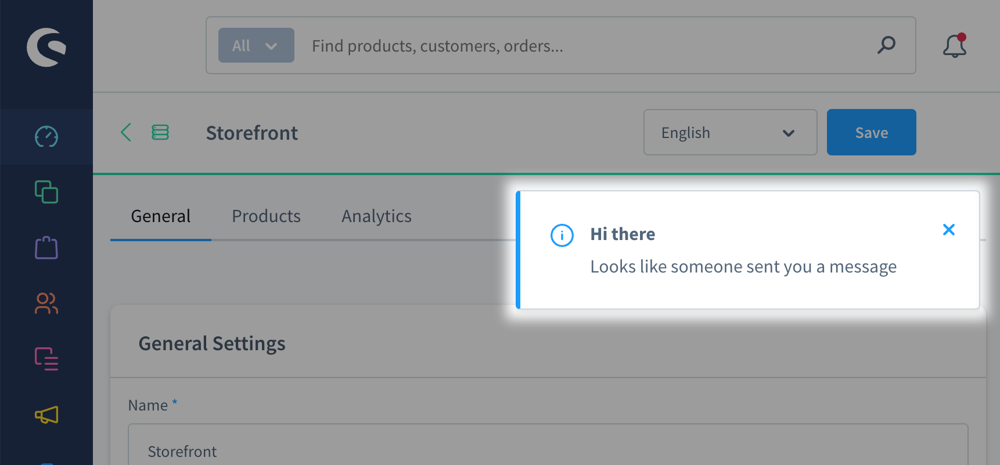

# App-Starter - Create an Admin Extension

In this guide, you will learn how to set up an extension for the administration UI.


When you are using a self-managed Shopware Version, make sure to set the feature flag `FEATURE_NEXT_17950=1` to enable the Admin Extension API.




## Prerequisites

In order to follow this guide, make sure you're familiar with and meet the following requirements:

 * Basic CLI usage (creating files, directories, running commands)
 * Installed [shopware-cli](https://sw-cli.fos.gg/) tools
 * We will use the following libraries / softwares
    * npm
    * ngrok (not required)
    * live-server (small local development live-reloading server)

## Create the App Wrapper

First of all we need to create the app "wrapper", the so-called app manifest. It is just a single XML file with some basic configuration.

### Create manifest file

First of all, we create a new directory that contains our project.

```bash
mkdir ListingExtension
```

within that directory, we create the manifest file.

```bash
cd ListingExtension
touch manifest.xml
```


When you are using a self-managed Shopware Version, you can also create the app base directory in the `custom/apps` directory of your Shopware installation. However, the descriptions in this guide apply to both Shopware cloud and self-managed stores.


Next, we're gonna put our basic configuration into the file we just created.


```xml
<?xml version="1.0" encoding="UTF-8"?>
<manifest xmlns:xsi="http://www.w3.org/2001/XMLSchema-instance" xsi:noNamespaceSchemaLocation="https://raw.githubusercontent.com/shopware/platform/trunk/src/Core/Framework/App/Manifest/Schema/manifest-1.0.xsd">
    <meta>
        <name>ListingExtension</name>
        <label>Listing Extension App</label>
        <description>This app extends the product listing</description>
        <author>shopware AG</author>
        <copyright>(c) shopware AG</copyright>
        <version>1.0.0</version>
        <license>MIT</license>
    </meta>
</manifest>

```


## Set up communication between Shopware and the App

Next, we need to set up an entry point, so Shopware and your app can communicate. The entry point is a static `.html` file, which includes the Extension SDK script and defines our extension.


> Create a graphic illustrating communication between Shopware and the App.

Let's create this file in a directory called `src`.

```bash
mkdir src
touch src/index.html
```


```html
<!doctype html>
<html>
    <head>
        <script src="https://unpkg.com/@shopware-ag/admin-extension-sdk/cdn"></script>
    </head>
    <script>
        sw.notification.dispatch({
            title: 'Hi there',
            message: 'Looks like someone sent you a message'
        });
    </script>
</html>

```


This file contains example code that displays a simple notification within the administration. 

### Start the local development server

Next, we need to start the live server so you don't always have to reload the page manually.

```bash
npm install -g live-server
live-server src
```

Now the file should be available on [http://127.0.0.1:8080](http://127.0.0.1:8080).

### Initiate the ngrok tunnel


For local development you don't need to set up the ngrok tunnel. As long as Shopware runs within your browser, it will be able to access the file locally. In that case, please continue with [Add the public link to your manifest](#add-the-public-link-to-your-manifest).


For the next step, we will use ngrok, so your local file gets exposed to the internet. This is required, so Shopware can access your extension point. We do that by simply running

```bash
ngrok http 8080
```

This command will expose your local port `8080` (which is the port of the [local development server](#start-the-local-development-server)) to the internet and make it accessible via http/s. If your development server is running on a different port, make sure to use that port when running `ngrok http`.

The output will be something similar to 

```bash
Session Status                online
Account                       John Doe (Plan: Free)
Version                       2.3.40
Version                       2.3.40
Region                        United States (us)
Web Interface                 http://127.0.0.1:4040
Forwarding                    http://9481-31-22-212-113.ngrok.io -> http://localhost:8080
Forwarding                    https://9481-31-22-212-113.ngrok.io -> http://localhost:8080
```

You `src` directory will now be available at the public ***.ngrok.io** links.

### Add the public link to your manifest

The final step of the setup is to configure your app to use correct public link for your entry point. In our case this is `https://9481-31-22-212-113.ngrok.io`.


As mentioned above, for testing/local development purposes the ngrok tunnel is not needed. Instead, just use the URL of your local node server (in our case this is [http://127.0.0.1:8080](http://127.0.0.1:8080)) and use it as your `app-base-url`.


In order to do that, we have to add an `admin` section to our `manifest.xml` file and pass it into the `base-app-url` tag:


```xml
<?xml version="1.0" encoding="UTF-8"?>
<manifest xmlns:xsi="http://www.w3.org/2001/XMLSchema-instance" xsi:noNamespaceSchemaLocation="https://raw.githubusercontent.com/shopware/platform/trunk/src/Core/Framework/App/Manifest/Schema/manifest-1.0.xsd">
    <meta>
        <!-- ... -->
    </meta>
    <admin>
        <base-app-url>https://9481-31-22-212-113.ngrok.io</base-app-url>
    </admin>
</manifest>
```


## Install the App

In this last setp, we're going to install the app using the Shopware CLI tools.


If this is your first time using the Shopware CLI, you have to [install](https://sw-cli.fos.gg/install/) it first. Next, configure it using the `shopware-cli project config init` command.


```bash
shopware-cli project extension upload ListingExtension --activate --increase-version
```

This command will create a zip file from the specified extension directory and upload it to your configured store.
The `--increase-version` parameter increases the version specified in the `manifest.xml` file. 


It is a currently known issue that whenever you make changes to the `manifest.xml` file, you need to increment the version number, so Shopware picks up the changes.


## Where from here?

 * Check out Admin Extension API
 * Set up with Webpack
 * What else can I do.