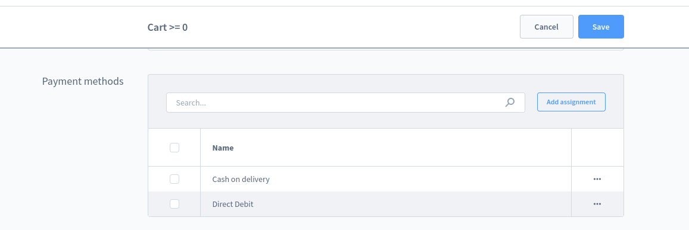

# Add rule assignment configuration

::: info
The rule assignment configuration is available from Shopware Version 6.4.8.0
:::

## Overview

You want to create a custom card in the rule assignment, where you can add or delete assignments? This guide gets you covered on this topic. Based on an example of the configuration of the `Dynamic Access` plugin, you will see how to write your configuration.



## Prerequisites

This guide **does not** explain how to create a new plugin for Shopware 6.
Head over to our Plugin base guide to learn how to create a plugin at first:

<PageRef page="../plugin-base-guide" />

## Creating the index.js file

The first step is creating a new directory like so `<plugin root>/src/Resources/app/administration/src/module/sw-settings-rule/extension/sw-settings-rule-detail-assignments`.
Right afterwards, create a new file called `index.js` in there.

Your custom module directory isn't known to Shopware 6 yet.
The entry point of your plugin is the `main.js` file.
That's the file you need to change now, so that it loads your extended component.
For this, simply add the following line to your `main.js` file:

```javascript
// <plugin root>/src/Resources/app/administration/src/main.js
import './module/sw-settings-rule/extension/sw-settings-rule-detail-assignments';
```

Now your module's `index.js` will be executed.

## Override the component

Your `index.js` is still empty now, so let's override the `sw-settings-rule-detail-assignments` component.
This is technically done by calling the method `override` method of our [ComponentFactory](https://github.com/shopware/platform/blob/trunk/src/Administration/Resources/app/administration/src/core/factory/component.factory.ts), which is available through our third party wrapper.
This method expects a name, and a configuration for the component you want to override.

```javascript
// <plugin root>/src/Resources/app/administration/src/module/sw-settings-rule/extension/sw-settings-rule-detail-assignments/index.js
Component.override('sw-settings-rule-detail-assignments', {
    // override configuration here
});
```

## Overriding the computed

Now your plugin is overriding the `sw-settings-rule-detail-assignments` component, but currently this has no effect.
In the `associationEntitiesConfig` computed property the configuration of the rule assignment is built and returned to the method which initiates the component.
Because of this, you have to override this computed property, get the computed property of the original component, add your own configuration of the rule assignment and return the whole configuration array.

```javascript
// <plugin root>/src/Resources/app/administration/src/module/sw-settings-rule/extension/sw-settings-rule-detail-assignments/index.js
Component.override('sw-settings-rule-detail-assignments', {
    computed: {
        associationEntitiesConfig() {
            const associationEntitiesConfig = this.$super('associationEntitiesConfig');
            associationEntitiesConfig.push(/* insert your configuration here */);
            return associationEntitiesConfig;
        },
    }
});
```

## Adding the configuration

The configuration of the rule assignment is passed as an object and offers a wide range of options.
Just have a look onto one example configuration item of the `Dynamic Access` plugin:

```javascript
// Example of a configuration item
getRuleAssignmentConfig()
{
    return [
        {
            id: 'swagDynamicAccessProducts',
            notAssignedDataTotal: 0,
            entityName: 'product',
            label: 'swag-dynamic-access.sw-settings-rule.detail.associations.productVisibility',
            criteria: () => {
                const criteria = new Criteria();
                criteria.setLimit(this.associationLimit);
                criteria.addFilter(Criteria.equals('swagDynamicAccessRules.id', this.rule.id));
                criteria.addAssociation('options.group');
                criteria.addAssociation('swagDynamicAccessRules');

                return criteria;
            },
            api: () => {
                const api = Object.assign({}, Context.api);
                api.inheritance = true;

                return api;
            },
            detailRoute: 'sw.product.detail.base',
            gridColumns: [
                {
                    property: 'name',
                    label: 'Name',
                    rawData: true,
                    sortable: true,
                    routerLink: 'sw.product.detail.prices',
                    allowEdit: false,
                },
            ],
            deleteContext: {
                type: 'many-to-many',
                entity: 'product',
                column: 'extensions.swagDynamicAccessRules',
            },
            addContext: {
                type: 'many-to-many',
                entity: 'swag_dynamic_access_product_rule',
                column: 'productId',
                searchColumn: 'name',
                criteria: () => {
                    const criteria = new Criteria();
                    criteria.addFilter(
                            Criteria.not('AND', [Criteria.equals('swagDynamicAccessRules.id', this.rule.id)]),
                    );
                    criteria.addAssociation('options.group');

                    return criteria;
                },
                gridColumns: [
                    {
                        property: 'name',
                        label: 'Name',
                        rawData: true,
                        sortable: true,
                        allowEdit: false,
                    },
                    // ...
                ],
            },
        },
    ];
}
```

Let's go through the most important entries, how to configure your rule assignment:

| Option | Description |
| :--- | :--- |
| id | Required identifier for the assignment, which is arbitrary but unique |
| entityName, criteria, api | Required for data loading of the assignment |
| gridColumns | To define the columns, which are shown in your assignment card. Have a look into the [data grid component](using-the-data-grid-component.md) for more information. |

### Provide to delete an assignment

If you want to provide to delete an assignment, you have to define the `deleteContext`. There are two types of the `deleteContext`.
The first one is the `one-to-many` type, which link to a column of the assignment entity like this:

```js
// Example of a one-to-many deleteContext
deleteContext: {
    type: 'one-to-many',
    entity: 'cms_block',
    column: 'extensions.swagCmsExtensionsBlockRule.visibilityRuleId',
},
```

The other type is `many-to-many`, which has to link to the `ManyToManyAssociationField` of the extension like this:

```js
// Example of a many-to-many deleteContext
deleteContext: {
    type: 'many-to-many',
    entity: 'category',
    column: 'extensions.swagDynamicAccessRules',
},
```

### Provide to add an assignment

If you want to provide to add an assignment, you have to define the `addContext`. This context has the same two types as the `deleteContext` (see above),
but the `addContext` has more options to fill out, because an add assignment modal has to be configured:

```js
// Example of a one-to-many addContext
addContext: {
    type: 'one-to-many',
    entity: 'shipping_method',
    column: 'availabilityRuleId',
    searchColumn: 'name',
    criteria: () => {
        const criteria = new Criteria();
        criteria.addFilter(Criteria.not(
            'AND',
            [Criteria.equals('availabilityRuleId', ruleId)],
        ));

        return criteria;
    },
    gridColumns: [
        {
            property: 'name',
            label: 'Name',
            rawData: true,
            sortable: true,
            allowEdit: false,
        },
        {
            property: 'description',
            label: 'Description',
            rawData: true,
            sortable: true,
            allowEdit: false,
        },
        {
            property: 'taxType',
            label: 'Tax calculation',
            rawData: true,
            sortable: true,
            allowEdit: false,
        },
        {
            property: 'active',
            label: 'Active',
            rawData: true,
            sortable: true,
            allowEdit: false,
        },
    ],
},
```

The `addContext` needs a definition of the `gridColumns`, the `entity` and the `criteria`, like in the general configuration.
Also, the context needs the `column` of the assignment and the `searchColumn` of the assigned entity.

A context of the `many-to-many` type would look like this:

```js
// Example of a many-to-many addContext
addContext: {
    type: 'many-to-many',
    entity: 'swag_dynamic_access_category_rule',
    column: 'categoryId',
    searchColumn: 'name',
    association: 'swagDynamicAccessRules',
    criteria: () => {
        const criteria = new Criteria();
        criteria.addFilter(Criteria.equals('parentId', null));

        return criteria;
    },
    gridColumns: [
        // Definition of columns
    ],
},
```

Beside the properties of a `one-to-many` type you have to define the `association` with the name of the `ManyToManyAssociationField`.

## Further reading

For more other information, refer to [Add custom rules](../framework/rule/add-custom-rules.md).
