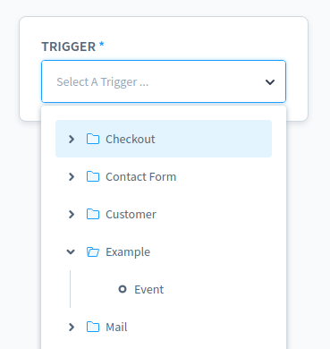
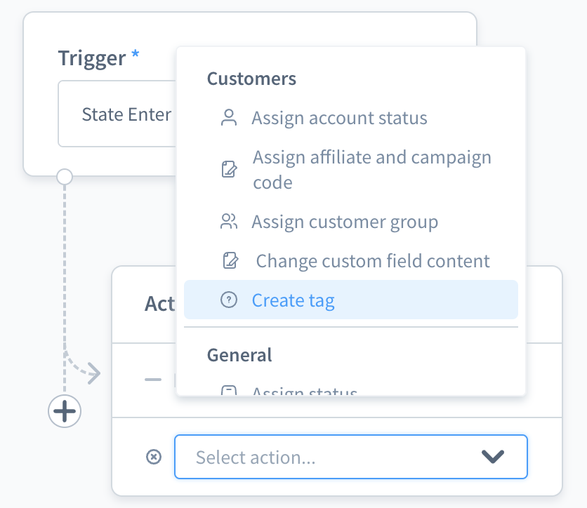

# Add custom flow Action


  This functionality is available starting with Shopware 6.4.6.0


## Overview

In this guide you'll learn how to create custom flow action in Shopware. Actions are used by the flow builder. This example will introduce a new custom action, which creates tags or assigning the tags.

## Prerequisites

In order to add your own custom flow action for your plugin, you first need a plugin as base. Therefore, you can refer to the [Plugin Base Guide.](../../plugin-base-guide.md)

You also should be familiar with the [Dependency Injection container](../../plugin-fundamentals/dependency-injection.md) as this is used to register your custom flow action and [Listening to events](../../plugins/plugin-fundamentals/listening-to-events#creating-your-own-subscriber) to create a subscriber class.

It might be helpful to gather some general understanding about the [concept of Flow Builder](../../../../../concepts/framework/flow-concept.md) as well.

## Existing triggers and actions

You can refer to the [Flow reference](../../../../../resources/references/core-reference/flow-reference.md) to read triggers and actions detail.
## Create custom flow action

To create a custom flow action, firstly you have to create a plugin and install it, you can refer to the [Plugin Base Guide](../../plugin-base-guide) to do it. I will create a plugin named `ExamplePlugin`. we have to implement both backend (PHP) code and a user interface in the administration to manage it. Let's start with the PHP part first, which basically handles the main logic of our action. After that, there will be an example to actually show your new action in the administration.

## Creating flow action in PHP

### Create new Aware interface

 First of all, we need to define an aware interface for your own action, I intended to create the `CreateTagAction`, so I need to create a related aware named `TagAware`, will be placed in directory `<plugin root>/src/Core/Framework/Event`. Our new interface has to extend from interfaces `Shopware\Core\Framework\Event\FLowEventAware`:


```php
<?php declare(strict_types=1);
namespace Swag\ExamplePlugin\Core\Framework\Event;
use Shopware\Core\Framework\Event\FlowEventAware;

interface TagAware extends FlowEventAware
{
}
```


### Create new action

In this example, we will name it `CreateTagAction`. It will be placed in the directory `<plugin root>/src/Core/Content/Flow/Dispatching/Action`. Our new class has to extend from the abstract class `Shopware\Core\Framework\Event\FLowEvent`. Below you can find an example implementation:


```php
<?php declare(strict_types=1);

namespace Swag\ExamplePlugin\Core\Content\Flow\Dispatching\Action;

use Shopware\Core\Content\Flow\Dispatching\Action\FlowAction;
use Shopware\Core\Framework\DataAbstractionLayer\EntityRepositoryInterface;
use Shopware\Core\Framework\Uuid\Uuid;
use Swag\ExamplePlugin\Core\Framework\Event\TagAware;
use Shopware\Core\Framework\Event\FlowEvent;

class CreateTagAction extends FlowAction
{
    private EntityRepositoryInterface $tagRepository;

    public function __construct(EntityRepositoryInterface $tagRepository)
    {
        // you would need this repository to create a tag
        $this->tagRepository = $tagRepository;
    }

    public static function getName(): string
    {
        // your own action name
        return 'action.create.tag';
    }

    public static function getSubscribedEvents(): array
    {
        return [
            self::getName() => 'handle',
        ];
    }

    public function requirements(): array
    {
        return [TagAware::class];
    }

    public function handle(FlowEvent $event): void
    {
        // config is the config data when created a flow sequence
        $config = $event->getConfig();

        // make sure your tags data is exist
        if (!\array_key_exists('tags', $config)) {
            return;
        }

        $baseEvent = $event->getEvent();

        $tags = $config['tags'];

        // just a step to make sure you're dispatching correct action
        if (!$baseEvent instanceof TagAware || empty($tags)) {
            return;
        }

        $tagData = [];
        foreach ($tags as $tag) {
            $tagData[] = [
                'id' => Uuid::randomHex(),
                'name' => $tag,
            ];
        }

        // simply create tags
        $this->tagRepository->create($tagData, $baseEvent->getContext());
    }
}
```


As you can see, several methods are already implemented:

- `__constructor`: This only defines the default expected value. This is overwritten at runtime with the actual value, that the shop owner set in the administration.
- `getName`: Returns a unique technical name for your action.
- `requirements`: This defined which interfaces that the action belongs to.
- `handle`: Use this method to handle your action stuff.

And we also need to register this action in the container as a service, make sure you have defined a tag `<tag name="flow.action" priority="600">` at `<plugin root>/src/Resources/config/services.xml`, that your action would be added to response of *`/api/_info/flow-actions.json`* API and `priority` will decide the order of action of API response:



```xml
<service id="Swag\ExamplePlugin\Core\Content\Flow\Dispatching\Action\CreateTagAction">
    <argument type="service" id="tag.repository" />
    <tag name="kernel.event_subscriber"/>
    <tag name="flow.action" priority="600"/>
</service>
```


Great, your own action is created completely, let's go to the next step.

### Define action scope

 At this step you will know how to define your action scope, for `CreateTagAction`, I intended it would be available for all events, let see the code below:


```php
<?php declare(strict_types=1);

namespace Swag\ExamplePlugin\Core\Content\Flow\Subscriber;

use Shopware\Core\Framework\Event\BusinessEventCollectorEvent;
use Swag\ExamplePlugin\Core\Framework\Event\TagAware;
use Symfony\Component\EventDispatcher\EventSubscriberInterface;

class BusinessEventCollectorSubscriber implements EventSubscriberInterface
{
    public static function getSubscribedEvents()
    {
        return [
            BusinessEventCollectorEvent::NAME => 'addTagAware',
        ];
    }

    public function addTagAware(BusinessEventCollectorEvent $event): void
    {
        foreach ($event->getCollection()->getElements() as $definition) {
            $definition->addAware(TagAware::class);
        }
    }
}
```


And don't forget to register your subscriber to the container at `<plugin root>/src/Resources/config/services.xml`.


```xml
<service id="Swag\ExamplePlugin\Core\Content\Flow\Subscriber\BusinessEventCollectorSubscriber">
    <tag name="kernel.event_subscriber"/>
</service>
```


Well done, you are successfully created your own custom action in Backend in PHP.


  This functionality is available starting with Shopware 6.4.6.0


## Add custom action in Administration

- Define action name in `example-plugin.constant.js`


```jsx
export const ACTION = Object.freeze({
    CREATE_TAG: 'action.create.tag',
});

export default {
    ACTION,
};
```


- Override `sw-flow-sequence-action` to show custom action in action list


```jsx
import { ACTION } from '../../constant/example-plugin.constant';

const { Component } = Shopware;

Component.override('sw-flow-sequence-action', {
    computed: {
        modalName() {
            if (this.selectedAction === ACTION.CREATE_TAG) {
                return 'example-plugin-create-tag-modal';
            }

            return this.$super('modalName');
        },

        actionDescription() {
            const actionDescriptionList = this.$super('actionDescription');

            return {
                ...actionDescriptionList,
                [ACTION.CALL_WEBHOOK] : (config) => this.getWebhookDescription(config),
            };
        },
    },

    methods: {
        getWebhookDescription(config) {
            let description = this.$tc('example-plugin.action.description', 0, {
                tag: config.method,
            });

            if (config.description) {
                description = description.concat(`<div class='sw-flow-sequence-action__example-description'>
                    ${this.$tc('example-plugin.modal.general.labelDescription')}: ${config.description}
                    </div>`);
            }

            return description;
        },

        getActionTitle(actionName) {
            if (actionName === ACTION.CREATE_TAG {
                return {
                    value: actionName,
                    icon: 'default-web-link',
                    label: this.$tc('example-plugin.action.titleAddCustomTag'),
                }
            }

            return this.$super('getActionTitle', actionName);
        },
    },
});
```







You might need a modal to save your action config. For example , `swag-example-plugin-modal`.



```tsx
import template from './swag-example-plugin-modal.html.twig';
const { Component } = Shopware;

Component.register('swag-example-plugin-modal', {
    template,

    props: {
        sequence: {
            type: Object,
            required: true,
        },
    },

    data() {
        return {
            tags: [],
        };
    },

    created() {
        this.createdComponent();
    },

    methods: {
        createdComponent() {
            this.tags = this.sequence?.config?.tags || [];
        },

        onClose() {
            this.$emit('modal-close');
        },

        onAddAction() {
            const sequence = {
                ...this.sequence,
                config: {
                    ...this.config,
                    tags: this.tags
                },
            };

            this.$emit('process-finish', sequence);
        },
    },
});
```



```html

    <sw-modal
        class="swag-example-plugin-modal"
        :title="$tc('swag-example-plugin.titleCreateTag')"
        @modal-close="onClose"
    >
        
            <sw-multi-tag-select
                v-model="tags"
                :label="$tc('swag-example-plugin.labelTags')"
            />
        

        
            <template #modal-footer>
                
                    <sw-button
                        class="swag-example-plugin-modal__cancel-button"
                        size="small"
                        @click="onClose"
                    >
                        {{ $tc('global.default.cancel') }}
                    </sw-button>
                

                
                    <sw-button
                        class="swag-example-plugin-modal__save-button"
                        variant="primary"
                        size="small"
                        @click="onAddAction"
                    >
                        {{ sequence.id
                        ? $tc('swag-example-plugin.buttonSaveAction')
                        : $tc('swag-example-plugin.buttonAddAction') }}
                    </sw-button>
                
            </template>
        
    </sw-modal>

```

### Demo
Now you can view the demo for this custom Flow builder triger and action as below.


The source code for this demo you could find it at [Flow Builder ExamplePlugin](https://github.com/huytdq94/sw-example-plugin-flow-builder).
