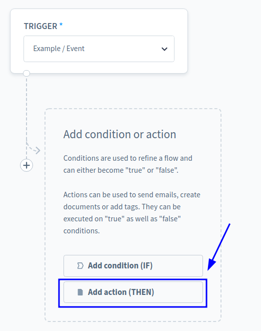
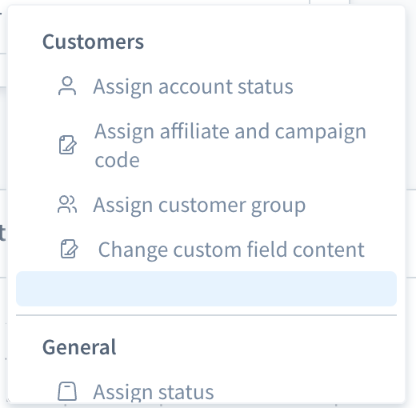
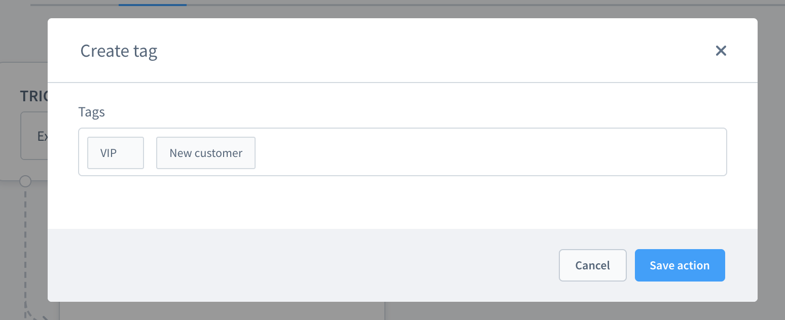
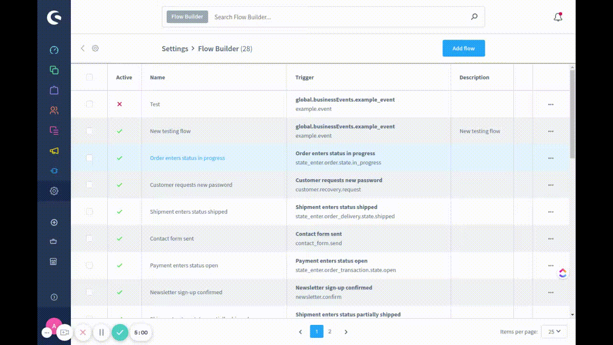

# Add custom flow Action


  This functionality is available starting with Shopware 6.4.6.0


## Overview

In this guide, you'll learn how to create custom flow action in Shopware. The flow builder uses actions to perform business tasks. This example will introduce a new custom action called `create tags`.

## Prerequisites

In order to add your own custom flow action for your plugin, you first need a plugin as base. Therefore, you can refer to the [Plugin Base Guide.](../../plugin-base-guide.md)

You also should be familiar with the [Dependency Injection container](../../plugin-fundamentals/dependency-injection.md) as this is used to register your custom flow action and [Listening to events](../../plugin-fundamentals/listening-to-events.md#creating-your-own-subscriber) to create a subscriber class.

It might be helpful to gather some general understanding about the [concept of Flow Builder](../../../../../concepts/framework/flow-concept.md) as well.

## Existing triggers and actions

You can refer to the [Flow reference](../../../../../resources/references/core-reference/flow-reference.md) to read triggers and actions detail.

## Create custom flow action

To create a custom flow action, firstly you have to make a plugin and install it, you can refer to the [Plugin Base Guide](../../plugin-base-guide.md) to do it. I will create a plugin named `ExamplePlugin`. We have to implement both backend (PHP) code and a user interface in the Administration to manage it. Let's start with the PHP part first, which handles the main logic of our action. After that, there will be an example to show your new actions in the Administration.

## Creating flow action in PHP

### Create new Aware interface

 First of all, we need to define an aware interface for your own action. I intended to create the `CreateTagAction`, so I need to create a related aware named `TagAware`, will be placed in directory `<plugin root>/src/Core/Framework/Event`. Our new interface has to extend from interfaces `Shopware\Core\Framework\Event\FLowEventAware`:



```php
<?php declare(strict_types=1);
namespace Swag\ExamplePlugin\Core\Framework\Event;
use Shopware\Core\Framework\Event\FlowEventAware;

interface TagAware extends FlowEventAware
{
    ...

    public const TAG = 'tag';

    public const TAG_ID = 'tagId';

    public function getTag();

    ...
}
```



### Create new action


Starting with the next major version (6.5.0.0), we are introducing changes in how to create new flow actions, please follow the instructions corresponding to your current version.


In this example, we will name it `CreateTagAction`. It will be placed in the directory `<plugin root>/src/Core/Content/Flow/Dispatching/Action`. Below you can find an example implementation:


  Available starting with Shopware 6.4.6.0


Our new class has to extend from the abstract class `Shopware\Core\Framework\Event\FLowEvent`.



```php
<?php declare(strict_types=1);

namespace Swag\ExamplePlugin\Core\Content\Flow\Dispatching\Action;

use Shopware\Core\Content\Flow\Dispatching\Action\FlowAction;
use Shopware\Core\Framework\DataAbstractionLayer\EntityRepository;
use Shopware\Core\Framework\Uuid\Uuid;
use Swag\ExamplePlugin\Core\Framework\Event\TagAware;
use Shopware\Core\Framework\Event\FlowEvent;

class CreateTagAction extends FlowAction
{
    private EntityRepository $tagRepository;

    public function __construct(EntityRepository $tagRepository)
    {
        // you would need this repository to create a tag
        $this->tagRepository = $tagRepository;
    }

    public static function getName(): string
    {
        // your own action name
        return 'action.create.tag';
    }

    public static function getSubscribedEvents(): array
    {
        return [
            self::getName() => 'handle',
        ];
    }

    public function requirements(): array
    {
        return [TagAware::class];
    }

    public function handle(FlowEvent $event): void
    {
        // config is the "Configuration data" you get after you create a flow sequence
        $config = $event->getConfig();

        // make sure your "tags" data exists
        if (!\array_key_exists('tags', $config)) {
            return;
        }

        $baseEvent = $event->getEvent();

        $tags = $config['tags'];

        // just a step to make sure you are dispatching the correct action
        if (!$baseEvent instanceof TagAware || empty($tags)) {
            return;
        }

        $tagData = [];
        foreach ($tags as $tag) {
            $tagData[] = [
                'id' => Uuid::randomHex(),
                'name' => $tag,
            ];
        }

        // simply create tags
        $this->tagRepository->create($tagData, $baseEvent->getContext());
    }
}
```



As you can see, several methods are already implemented:

- `__constructor`: This only defines the default expected value. This is overwritten at runtime with the actual value, that the shop owner set in the Administration.
- `getName`: Returns a unique technical name for your action.
- `requirements`: This defines which interfaces that the action belongs to.
- `handle`: Use this method to handle your action stuff.


  Available starting with Shopware 6.5.0.0




```php
<?php declare(strict_types=1);

namespace Swag\ExamplePlugin\Core\Content\Flow\Dispatching\Action;

use Shopware\Core\Content\Flow\Dispatching\Action\FlowAction;
use Shopware\Core\Framework\DataAbstractionLayer\EntityRepository;
use Shopware\Core\Framework\Uuid\Uuid;
use Swag\ExamplePlugin\Core\Framework\Event\TagAware;
use Shopware\Core\Content\Flow\Dispatching\StorableFlow;

class CreateTagAction extends FlowAction
{
    private EntityRepository $tagRepository;

    public function __construct(EntityRepository $tagRepository)
    {
        // you would need this repository to create a tag
        $this->tagRepository = $tagRepository;
    }

    public static function getName(): string
    {
        // your own action name
        return 'action.create.tag';
    }

    public function requirements(): array
    {
        return [TagAware::class];
    }

    public function handleFlow(StorableFlow $flow): void
    {
        // config is the config data when created a flow sequence
        $config = $flow->getConfig();

        // make sure your tags data is exist
        if (!\array_key_exists('tags', $config)) {
            return;
        }

        $tags = $config['tags'];

        // just a step to make sure you're dispatching correct action
        if (!$flow->hasStore(TagAware::TAG_ID) || empty($tags)) {
            return;
        }

        // get tag id
        $tagId = $flow->getStore(TagAware::TAG_ID);

        // get tag
        $tag = $flow->getData(TagAware::TAG);

        $tagData = [];
        foreach ($tags as $tag) {
            $tagData[] = [
                'id' => Uuid::randomHex(),
                'name' => $tag,
            ];
        }

        // simply create tags
        $this->tagRepository->create($tagData, $baseEvent->getContext());
    }
}
```



As you can see, several methods are already implemented:

- `__constructor`: This only defines the default expected value. This is overwritten at runtime with the actual value, that the shop owner set in the Administration.
- `getName`: Returns a unique technical name for your action.
- `requirements`: This defines which interfaces the action belongs to.
- `handleFlow`: Use this method to handle your action stuff.
    - Use `$flow->getStore($key)` if you want to get the data from aware interfaces. E.g: `tag_id` in `TagAware`, `customer_id` from `CustomerAware` and so on.
    - Use `$flow->getData($key)` if you want to get the data from original events or additional data. E.g: `tag`, `customer`, `contactFormData` and so on.

And we also need to register this action in the container as a service, make sure you have defined a tag `<tag name="flow.action" priority="600">` at `<plugin root>/src/Resources/config/services.xml`, that your action would be added to response of *`/api/_info/flow-actions.json`* API and `priority` will decide the order of action of API response:


  Available starting with Shopware 6.4.6.0




```xml
<service id="Swag\ExamplePlugin\Core\Content\Flow\Dispatching\Action\CreateTagAction">
    <argument type="service" id="tag.repository" />
    <tag name="kernel.event_subscriber"/>
    <tag name="flow.action" priority="600"/>
</service>
```


  Available starting with Shopware 6.5.0.0




```xml
<service id="Swag\ExamplePlugin\Core\Content\Flow\Dispatching\Action\CreateTagAction">
    <argument type="service" id="tag.repository" />
    <tag name="kernel.event_subscriber"/>
    <tag name="flow.action" priority="600" key="action.create.tag"/>
</service>
```



Great, your own action is created completely. Let's go to the next step.

### Define action scope

 At this step, you will know how to define your action scope, for `CreateTagAction`, I intended it would be available for all events. Let's see the code below:



```php
<?php declare(strict_types=1);

namespace Swag\ExamplePlugin\Core\Content\Flow\Subscriber;

use Shopware\Core\Framework\Event\BusinessEventCollectorEvent;
use Swag\ExamplePlugin\Core\Framework\Event\TagAware;
use Symfony\Component\EventDispatcher\EventSubscriberInterface;

class BusinessEventCollectorSubscriber implements EventSubscriberInterface
{
    public static function getSubscribedEvents()
    {
        return [
            BusinessEventCollectorEvent::NAME => 'addTagAware',
        ];
    }

    public function addTagAware(BusinessEventCollectorEvent $event): void
    {
        foreach ($event->getCollection()->getElements() as $definition) {
            $className = \explode('\\', TagAware::class);
            $definition->addAware(\lcfirst(\end($className)));
        }
    }
}
```



And don't forget to register your subscriber to the container at `<plugin root>/src/Resources/config/services.xml`.



```xml
<service id="Swag\ExamplePlugin\Core\Content\Flow\Subscriber\BusinessEventCollectorSubscriber">
    <tag name="kernel.event_subscriber"/>
</service>
```



Well done, you are successfully created your custom action in Backend in PHP.


  This functionality is available starting with Shopware 6.4.6.0


## Add custom action in Administration

After we are done with the PHP code, `action.create.tag` is received from the response of `/api/_info/flow-actions.json`. However, the custom action displays in the action list without label. These further steps in Administration will help you show the action label and add configuration for it.

To see action list, we select a Trigger, for example [Example\Event] from the Trigger drop-down in the Flow tab. After that, we choose option `ACTION (THEN)`. A action component appears with action list.






### Step 1: Show action label in action list

First, we need to define an action name in `example-plugin.constant.js`. To be consistent with the custom action defined in our PHP code, we also create a constant called `CREATE_TAG` to represent `action.create.tag` which get from the response of `/api/_info/flow-actions.json`.




```jsx
export const ACTION = Object.freeze({
    CREATE_TAG: 'action.create.tag',
});

export const GROUP = 'customer'

export default {
    ACTION, GROUP
};
```



**Grouping Actions**

Using the `GROUP` constant, you can define a group that your action will show up in. The default group is `general`.

| Group Name | Group Headline |
| :--- | :--- |
| general | General|
| tag | Tag |
| customer | Customer |
| order | Order |

Next, we override `sw-flow-sequence-action` component to show `CREATE_TAG` label in action list. For example, we override `getActionTitle` method to add icon, label for `CREATE_TAG` action.



```jsx
import { ACTION, GROUP } from '../../constant/swag-example-plugin.constant';

const { Component } = Shopware;

Component.override('sw-flow-sequence-action', {
    computed: {
        // Not necessary if you use an existing group
        // Push the `groups` method in computed if you are defining a new group
        groups() {
             this.actionGroups.unshift(GROUP);

            return this.$super('groups');
        },
    },

    methods: {
        getActionTitle(actionName) {
            if (actionName === ACTION.CREATE_TAG) {
                return {
                    value: actionName,
                    icon: 'default-badge-help',
                    label: this.$tc('swag-example-plugin.titleCreateTag'),
                    group: GROUP,
                }
            }

            return this.$super('getActionTitle', actionName);
        },
    },
});
```



Here is the result for the after the **Step 1**.


### Step 2: Add configuration for action

First, we customise `modalName` for the configuration modal, add an `actionDescription` computed property and create the `getCreateTagDescription` method to show action the configuration description.



```jsx
import { ACTION, GROUP } from '../../constant/swag-example-plugin.constant';

const { Component } = Shopware;

Component.override('sw-flow-sequence-action', {
    computed: {
        modalName() {
            if (this.selectedAction === ACTION.CREATE_TAG) {
                return 'swag-example-plugin-modal';
            }

            return this.$super('modalName');
        },

        actionDescription() {
            const actionDescriptionList = this.$super('actionDescription');

            return {
                ...actionDescriptionList,
                [ACTION.CREATE_TAG] : (config) => this.getCreateTagDescription(config),
            };
        },
    },

    methods: {
        getCreateTagDescription(config) {
            const tags = config.tags.join(', ');

           return this.$tc('swag-example-plugin.descriptionTags', 0, {
                tags
            });
        },

        getActionTitle(actionName) {
            if (actionName === ACTION.CREATE_TAG) {
                return {
                    value: actionName,
                    icon: 'default-badge-help',
                    label: this.$tc('swag-example-plugin.titleCreateTag'),
                    group: GROUP,
                }
            }

            return this.$super('getActionTitle', actionName);
        },
    },
});
```



Then, we need a modal to save your action config. For example, we create a component `swag-example-plugin-modal`.

#### JavaScript file



```jsx
import template from './swag-example-plugin-modal.html.twig';
const { Component } = Shopware;

Component.register('swag-example-plugin-modal', {
    template,

    props: {
        sequence: {
            type: Object,
            required: true,
        },
    },

    data() {
        return {
            tags: [],
        };
    },

    created() {
        this.createdComponent();
    },

    methods: {
        createdComponent() {
            this.tags = this.sequence?.config?.tags || [];
        },

        onClose() {
            this.$emit('modal-close');
        },

        onAddAction() {
            const sequence = {
                ...this.sequence,
                config: {
                    ...this.config,
                    tags: this.tags
                },
            };

            this.$emit('process-finish', sequence);
        },
    },
});
```



#### Twig template file




```html

    <sw-modal
        class="swag-example-plugin-modal"
        :title="$tc('swag-example-plugin.titleCreateTag')"
        @modal-close="onClose"
    >
        
            <sw-multi-tag-select
                v-model="tags"
                :label="$tc('swag-example-plugin.labelTags')"
            />
        

        
            <template #modal-footer>
                
                    <sw-button
                        class="swag-example-plugin-modal__cancel-button"
                        size="small"
                        @click="onClose"
                    >
                        {{ $tc('global.default.cancel') }}
                    </sw-button>
                

                
                    <sw-button
                        class="swag-example-plugin-modal__save-button"
                        variant="primary"
                        size="small"
                        @click="onAddAction"
                    >
                        {{ sequence.id
                        ? $tc('swag-example-plugin.buttonSaveAction')
                        : $tc('swag-example-plugin.buttonAddAction') }}
                    </sw-button>
                
            </template>
        
    </sw-modal>

```




Here is the final result



Click on [Save action] and we will get the result as below screenshot.


#### Custom configuration for action without the modal

You don't need a modal for the configuration. It can be added automatically.

Imagine, your action is already in the action list after [the first step](#step-1-show-action-label-in-action-list)


First, override the `openDynamicModal` method in the plugin to check if the value matches the desired action. Then, call the `onSaveActionSuccess` directly with the configuration. After the check, call `return`.

#### JavaScript



```jsx
import template from './sw-flow-sequence-action.html.twig';
const { Component } = Shopware;

Component.register('sw-flow-sequence-action', {
    methods: {
        openDynamicModal(value) {
            if (!value) {
                return;
            }

            if (value === ACTION.CREATE_TAG) {
                this.selectedAction = ACTION.CREATE_TAG;
                const config = {
                    tags: 'VIP, New customer'
                };

                // Config can be a result from an API.

                this.onSaveActionSuccess({ config });
                return;
            }

            // handle for the rest of actions.
        },
    },
});
```



Now, after you click on the action, the new sequence will automatically be added to the action list like this:


### Demo

You can view the whole demo for this custom Flow Builder trigger and action below:


