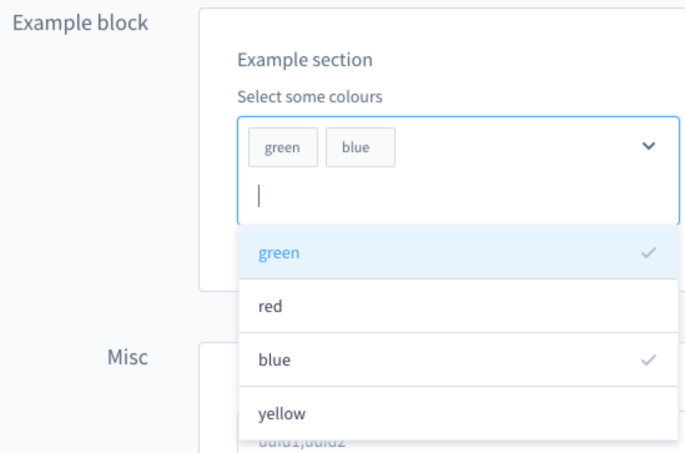
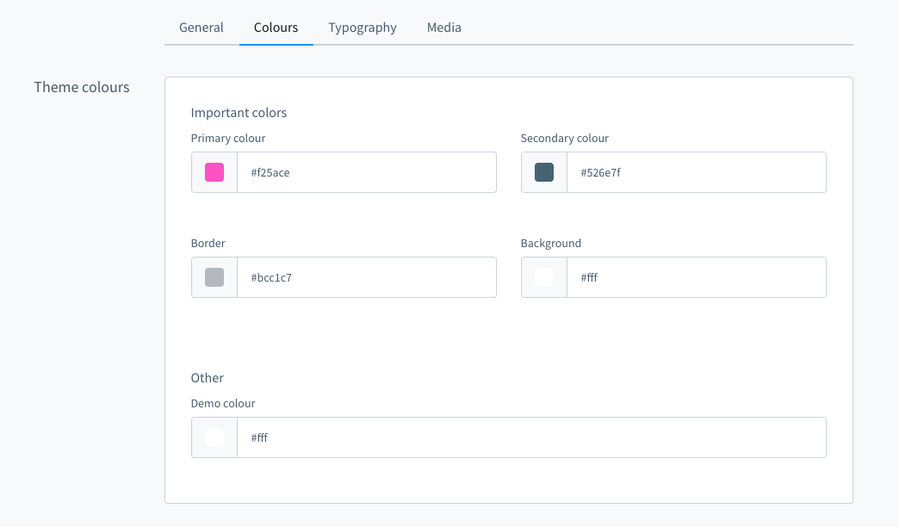

# Theme configuration

## Overview

This guide shows you how the theme configuration works and explains the possibilities of the settings in more depth.

## Prerequisites

This guide is built upon the [Create a first theme](./create-a-theme.md) guide.

## Structure of theme configuration

The theme configuration for a theme is located in the `theme.json` file `<plugin root>/src/Resources` folder. Open up the `<plugin root>/src/Rescoure/theme.json` file with your favorite code-editor. The configuration looks like this.


```json
{
  "name": "SwagBasicExampleTheme",
  "author": "Shopware AG",
  "views": [
     "@Storefront",
     "@Plugins",
     "@SwagBasicExampleTheme"
  ],
  "style": [
    "app/storefront/src/scss/overrides.scss",
    "@Storefront",
    "app/storefront/src/scss/base.scss"
  ],
  "script": [
    "@Storefront",
    "app/storefront/dist/storefront/js/swag-basic-example-theme.js"
  ],
  "asset": [
    "@Storefront",
    "app/storefront/src/assets"
  ]
}
```



  If you make changes or additions to the `theme.json` file, you must then execute the `theme:refresh` command to put them into effect. Run `bin/console theme:refresh` in order to update your theme.


Let's have a closer look at each section.


```json
{
  "name": "SwagBasicExampleTheme",
  "author": "Shopware AG",
  "description": {
    "en-GB": "Just another description",
    "de-DE": "Nur eine weitere Beschreibung"
  },
  ...
}
```


Here change the `name` of your theme and the `author`.
The `description` section is optional and as you notice it is also translatable.

The `views` section controls the template inheritance. This will be covered in the [PLACEHOLDER_LINK: Theme inheritance] guide.


```json
{
  ...
  "views": [
     "@Storefront",
     "@Plugins",
     "@SwagBasicExampleTheme"
  ],
  ...
}
```


The `style` section determines the order of the CSS compilation. In the `<plugin root>/app/storefront/src/scss/base.scss` file you can apply your changes you want to make to the `@Storefront` standard styles or add other styles you need.
The `<plugin root>/app/storefront/src/scss/overrides.scss` file is used for a special case. Maybe you need to override some defined `variables` or `functions` defined by Shopware or Boostrap, you can implement your changes here.
Checkout the [Override bootstrap variables in a theme](./override-bootstrap-variables-in-a-theme.md) guide for further information.


```json
{
  ...
  "style": [
    "app/storefront/src/scss/overrides.scss",
    "@Storefront",
    "app/storefront/src/scss/base.scss"
  ],
  ...
}
```


## Assets

The `asset` option you can configure your paths to your assets like images, fonts, etc.
The standard location to put your assets to is the `<plugin root>/app/storefront/src/assets` folder.
Checkout the [Add assets to theme](./add-assets-to-theme.md) guide for further information.


```json
{
  ...
  "asset": [
     "app/storefront/src/assets"
   ]
  ...
}
```


If you need the assets from the default storefront theme for your custom theme, just add `@Storefront` as asset path


```json
{
  ...
  "asset": [
     "@Storefront",
     "app/storefront/src/assets"
   ]
  ...
}
```


## Config fields

One of the benefits of creating a theme is that you can overwrite the theme configuration of 
the default theme or add your own configurations.


```json
{
  ... 
  "asset":[
    ...
  ],
  "config": {
      "fields": {
        "sw-color-brand-primary": {
          "value": "#00ff00"
        }
      }
   }
}
```


In the example above, we change the primary color to green. You always inherit from the storefront
config and both configurations are merged. This also means that you only have to provide the values you
actually want to change. You can find a more detailed explanation of the configuration inheritance
in the section [Theme inheritance](./add-theme-inheritance.md).


If you overwrite variables of another theme from a third party provider and these are renamed or removed at a later time, this can lead to issues and the theme can no longer be compiled. So be aware of it.


The `theme.json` contains a `config` property which contains a list of tabs, blocks, sections and fields.

The key of each config field item is also the technical name which you use to access the config option
in your theme or scss files. `config` entries will show up in the administration and 
can be customized by the end user (if `editable` is set to `true`, see table below).

The following parameters can be defined for a config field item:

| Name         | Meaning                                                                                          |
|------------- |--------------------------------------------------------------------------------------------------|
| label        | Array of translations with locale code as key                                                    |
| type         | Type of the config. Possible values: color, text, number, fontFamily, media, checkbox and switch |
| editable     | If set to false, the config option will not be displayed (e.g. in the administration)            |
| tab          | Name of a tab to organize the config options                                                     |
| block        | Name of a block to organize the config options                                                   |
| section      | Name of a section to organize the config options                                                 |
| custom       | The defined data will not be processed but is available via API                                  |
| scss         | If set to false, the config option will not be injected as a SCSS variable                       |
| fullWidth    | If set to true, the administration component width will be displayed in full width               |

## Field types
You can use different field types in your theme manager:

* A text field example:


```json
{
  ...
  "config": {
    "fields": {
      "modal-padding": {
        "label": {
          "en-GB": "Modal padding",
          "de-DE": "Modal Innenabstand"
        },
        "type": "text",
        "value": "(0, 0, 0, 0)",
        "editable": true
      }
    }
  }
}
```


* A number field example: 


```json
{
  ...
  "config": {
    "fields": {
      "visible-slides": {
        "label": {
          "en-GB": "Number of visible slides",
          "de-DE": "Anzahl an sichtbaren Slider Bildern"
        },
        "type": "number",
        "custom": {
          "numberType": "int",
          "min": 1,
          "max": 6
        },
        "value": 3,
        "editable": true
      }
    }
  }
}
```


* Two boolean field examples:


```json
{
  ...
  "config": {
    "fields": {
      "navigation-fixed": {
        "label": {
          "en-GB": "Fix navigation",
          "de-DE": "Navigation fixieren"
        },
        "type": "switch",
        "value": true,
        "editable": true
      }
    }
  }
}
```


or


```json
{
  ...
  "config": {
    "fields": {
      "navigation-fixed": {
        "label": {
          "en-GB": "Fix navigation",
          "de-DE": "Navigation fixieren"
        },
        "type": "checkbox",
        "value": true,
        "editable": true
      }
    }
  }
}
```


## Examples for custom config fields

* A custom single-select field example


```json
{
  "name": "Just another theme",
  "author": "Just another author",
  "description": {
    "en-GB": "Just another description",
    "de-DE": "Nur eine weitere Beschreibung"
  },
  "views": [
    "@Storefront",
    "@Plugins",
    "@SelectExample"
  ],
  "style": [
    "app/storefront/src/scss/overrides.scss",
    "@Storefront",
    "app/storefront/src/scss/base.scss"
  ],
  "script": [
    "@Storefront",
    "app/storefront/dist/storefront/js/select-example.js"
  ],
  "asset": [
    "@Storefront",
    "app/storefront/src/assets"
  ],
  "config": {
    "blocks": {
      "exampleBlock": {
        "label": {
          "en-GB": "Example block",
          "de-DE": "Beispiel Block"
        }
      }
    },
    "sections": {
      "exampleSection": {
        "label": {
          "en-GB": "Example section",
          "de-DE": "Beispiel Sektion"
        }
      }
    },
    "fields": {
      "my-single-select-field": {
        "label": {
          "en-GB": "Select a font size",
          "de-DE": "Wähle ein Schriftgröße"
        },
        "type": "text",
        "value": "24",
        "custom": {
          "componentName": "sw-single-select",
          "options": [
            {
              "value": "16",
              "label": {
                "en-GB": "16px",
                "de-DE": "16px"
              }
            },
            {
              "value": "20",
              "label": {
                "en-GB": "20px",
                "de-DE": "20px"
              }
            },
            {
              "value": "24",
              "label": {
                "en-GB": "24px",
                "de-DE": "24px"
              }
            }
          ]
        },
        "editable": true,
        "block": "exampleBlock",
        "section": "exampleSection"
      }
    }
  }
}
```



* A custom multi-select field example


```json
{
  "name": "Just another theme",
  "author": "Just another author",
  "description": {
    "en-GB": "Just another description",
    "de-DE": "Nur eine weitere Beschreibung"
  },
  "views": [
    "@Storefront",
    "@Plugins",
    "@SelectExample"
  ],
  "style": [
    "app/storefront/src/scss/overrides.scss",
    "@Storefront",
    "app/storefront/src/scss/base.scss"
  ],
  "script": [
    "@Storefront",
    "app/storefront/dist/storefront/js/select-example.js"
  ],
  "asset": [
    "@Storefront",
    "app/storefront/src/assets"
  ],
  "config": {
    "blocks": {
      "exampleBlock": {
        "label": {
          "en-GB": "Example block",
          "de-DE": "Beispiel Block"
        }
      }
    },
    "sections": {
      "exampleSection": {
        "label": {
          "en-GB": "Example section",
          "de-DE": "Beispiel Sektion"
        }
      }
    },
    "fields": {
      "my-multi-select-field": {
        "label": {
          "en-GB": "Select some colours",
          "de-DE": "Wähle Farben aus"
        },
        "type": "text",
        "editable": true,
        "value": [
          "green",
          "blue"
        ],
        "custom": {
          "componentName": "sw-multi-select",
          "options": [
            {
              "value": "green",
              "label": {
                "en-GB": "green",
                "de-DE": "grün"
              }
            },
            {
              "value": "red",
              "label": {
                "en-GB": "red",
                "de-DE": "rot"
              }
            },
            {
              "value": "blue",
              "label": {
                "en-GB": "blue",
                "de-DE": "blau"
              }
            },
            {
              "value": "yellow",
              "label": {
                "en-GB": "yellow",
                "de-DE": "gelb"
              }
            }
          ]
        },
        "block": "exampleBlock",
        "section": "exampleSection"
      }
    }
  }
}
```




## Tabs, blocks and sections
You can use tabs, blocks and sections to structure and group the config options.



In the picture above are four tabs. In the "Colours" tab there is one block "Theme colours" which contains two sections 
named "Important colors" and "Other". You can define the block and section individually for each item. Example:


```json
{
  "name": "Just another theme",
  "author": "Just another author",
  
  "config": {
    "fields": {
      "sw-color-brand-primary": {
        "label": {
          "en-GB": "Primary colour",
          "de-DE": "Primär"
        },
        "type": "color",
        "value": "#399",
        "editable": true,
        "tab": "colors",
        "block": "themeColors",
        "section": "importantColors"
      }
    }
  }
}
```


The tab and section property is not required.

You can extend the config to add translated labels for the tabs, blocks and sections:


```json
{
  "name": "Just another theme",
  "author": "Just another author",
  
  "config": {
    "blocks": {
      "colors": {
        "themeColors": {
          "en-GB": "Theme colours",
          "de-DE": "Theme Farben"
        }
      }
    },
    "sections": {
      "importantColors": {
        "label": {
          "en-GB": "Important colors",
          "de-DE": "Wichtige Farben"
        }
      }
    },
    "tabs": {
      "colors": {
          "label": {
              "en-GB": "Colours",
              "de-DE": "Farben"
          }
      } 
    },
    "fields": {
      "sw-color-brand-primary": {
        "label": {
          "en-GB": "Primary colour",
          "de-DE": "Primär"
        },
        "type": "color",
        "value": "#399",
        "editable": true,
        "tab": "colors",
        "block": "themeColors",
        "section": "importantColors"
      }
    }
  }
}
```


## Next steps

Now that you know how to configure your theme, here is a list of things you can do.

* [Add SCSS Styling and JavaScript to a theme](./add-css-js-to-theme.md) 
* [Customize Templates](../plugins/storefront/customize-templates.md)